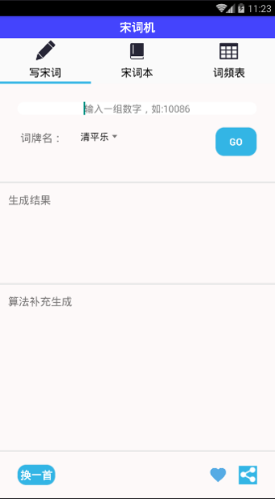
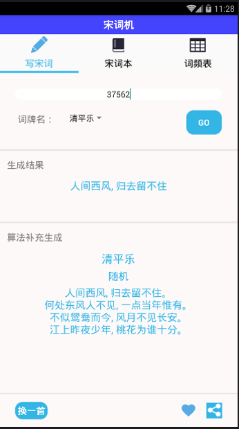
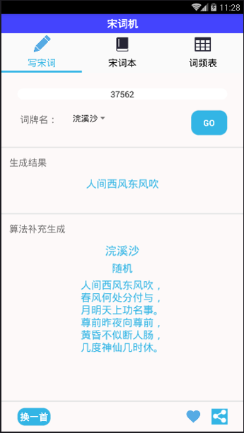
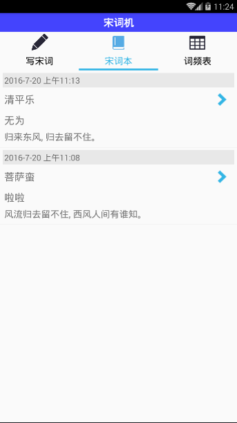
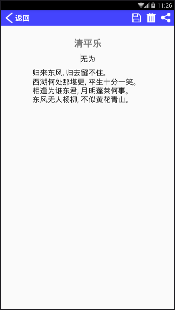

# Song-Ci-Poetry-Machine
基于Android的宋词自动生成软件

本项目是高级软件实作的课程实践，项目灵感来源于：
[统计词话（一）邱怡轩](http://cos.name/2011/03/statistics-in-chinese-song-poem-1/)

### UI效果
#### 写宋词Fragment

#### 宋词本Fragment

##### 宋词编辑界面

##### 词频表Fragment

